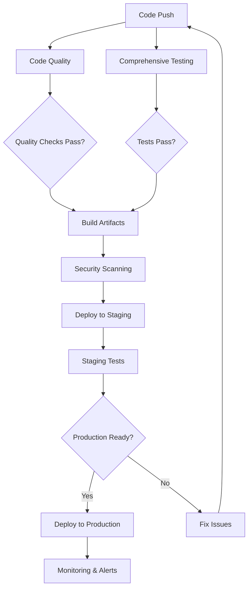

# CI/CD Pipeline Documentation

This document describes the comprehensive CI/CD pipeline implemented for NightScan, providing automated testing, building, security scanning, and deployment capabilities.

## 🚀 Overview

The NightScan CI/CD pipeline provides:

- **Multi-language Support**: Python, JavaScript/React Native, PHP, Shell scripts
- **Comprehensive Testing**: Unit, integration, performance, and security tests
- **Quality Assurance**: Code formatting, linting, type checking, security scanning
- **Automated Building**: Docker images, mobile apps, WordPress plugins
- **Staged Deployments**: Staging and production environments with blue-green deployment
- **Monitoring & Alerts**: Continuous monitoring with automated notifications
- **Dependency Management**: Automated dependency updates with Dependabot

## 🏗️ Pipeline Architecture

### Workflow Overview



### Workflow Files

| Workflow | Purpose | Triggers | Duration |
|----------|---------|----------|----------|
| `code-quality.yml` | Code quality & security checks | Push, PR | ~15 min |
| `test-comprehensive.yml` | Multi-component testing | Push, PR | ~25 min |
| `build-deploy.yml` | Build artifacts & deploy | Push to main, tags | ~45 min |
| `monitoring.yml` | System monitoring & health | Schedule, manual | ~20 min |
| `dependabot.yml` | Dependency updates | Weekly schedule | N/A |

## 📋 Detailed Workflow Descriptions

### 1. Code Quality & Security (`code-quality.yml`)

**Purpose**: Ensures code meets quality and security standards

**Components**:
- **Python Quality**: Black formatting, isort, Ruff linting, MyPy type checking
- **Security Analysis**: Bandit security scanner, Safety vulnerability checker
- **Dockerfile Security**: Hadolint linting, Trivy security scanning
- **Kubernetes Validation**: Manifest validation, security scanning
- **Mobile Quality**: ESLint, Prettier, TypeScript compilation
- **WordPress Quality**: PHP CodeSniffer, security pattern checking

**Key Features**:
- 🔒 **Security-first approach** with comprehensive scanning
- 📈 **Quality metrics** with detailed reporting
- 🔄 **Multi-language support** for all project components
- 📊 **SARIF integration** for GitHub Security tab

### 2. Comprehensive Testing (`test-comprehensive.yml`)

**Purpose**: Validates functionality across all system components

**Test Suites**:
- **Python Unit Tests**: Python 3.13 compatibility testing
- **Integration Tests**: Database + Redis integration with real services
- **Mobile Tests**: React Native Jest testing with coverage
- **Docker Tests**: Container build validation and security scanning
- **API Tests**: Performance testing with Locust load testing
- **Security Tests**: Validation scripts and WordPress security checks

**Advanced Features**:
- 🔄 **Parallel Execution**: Matrix builds for faster feedback
- 📊 **Coverage Tracking**: Codecov integration with detailed reports
- 🎥 **Service Dependencies**: Real PostgreSQL and Redis instances
- ⚡ **Performance Benchmarking**: Automated performance regression detection

### 3. Build & Deploy (`build-deploy.yml`)

**Purpose**: Builds artifacts and manages deployments

**Build Components**:
- **Container Images**: Multi-arch Docker builds (AMD64, ARM64)
- **Mobile App**: iOS React Native application with Xcode
- **WordPress Plugins**: Packaged plugins with security validation
- **SBOM Generation**: Software Bill of Materials for compliance

**Deployment Strategy**:
- **Staging Deployment**: Automatic deployment on main branch
- **Production Deployment**: Tag-based or manual deployment
- **Blue-Green Strategy**: Zero-downtime production deployments
- **Rollback Capability**: Automatic rollback on deployment failure

**Security Features**:
- 🔒 **Pre-deployment Security**: Security validation before production
- 🔍 **Container Scanning**: Trivy vulnerability scanning
- 📁 **Artifact Signing**: Secure artifact distribution
- 🛡️ **Compliance**: SBOM generation for supply chain security

### 4. Monitoring & Alerts (`monitoring.yml`)

**Purpose**: Continuous system health monitoring and alerting

**Monitoring Components**:
- **Health Checks**: Application endpoint monitoring
- **Performance Monitoring**: Response time and throughput tracking
- **Security Monitoring**: Continuous security scanning
- **Infrastructure Monitoring**: Kubernetes and Docker validation

**Alert Mechanisms**:
- 📢 **Multi-channel Notifications**: Slack, email, PagerDuty integration
- 📈 **Trend Analysis**: Performance regression detection
- 🚨 **Escalation Policies**: Automated incident response
- 📅 **Scheduled Checks**: Hourly health checks, daily comprehensive scans

## 🔧 Configuration

### Environment Variables

```bash
# GitHub Secrets (configured in repository settings)
KUBE_CONFIG_STAGING=<base64-encoded-kubeconfig>
KUBE_CONFIG_PRODUCTION=<base64-encoded-kubeconfig>
SLACK_WEBHOOK_URL=<slack-webhook-for-notifications>
CODECOV_TOKEN=<codecov-token-for-coverage>
DOCKER_REGISTRY_TOKEN=<docker-registry-access-token>

# Environment-specific variables
STAGING_URL=https://staging.nightscan.example.com
PRODUCTION_URL=https://nightscan.example.com
MONITORING_ENDPOINTS=health,ready,metrics
```

### Repository Settings

#### Branch Protection Rules

```yaml
# main branch protection
branch_protection:
  required_status_checks:
    strict: true
    contexts:
      - "Code Quality Checks"
      - "Python Unit Tests"
      - "Python Integration Tests"
      - "Container Security Scan"
  enforce_admins: true
  required_pull_request_reviews:
    required_approving_review_count: 1
    dismiss_stale_reviews: true
    require_code_owner_reviews: true
  restrictions: null
```

#### Environments

```yaml
# Staging environment
staging:
  protection_rules:
    required_reviewers: []
    wait_timer: 0
  variables:
    ENVIRONMENT: staging
    DEBUG: true

# Production environment
production:
  protection_rules:
    required_reviewers: ["@ops-team"]
    wait_timer: 300  # 5 minute delay
  variables:
    ENVIRONMENT: production
    DEBUG: false
```

### Pre-commit Hooks

The pipeline includes comprehensive pre-commit hooks:

```bash
# Install pre-commit hooks
pip install pre-commit
pre-commit install

# Run hooks manually
pre-commit run --all-files

# Update hooks
pre-commit autoupdate
```

## 📊 Metrics & Monitoring

### Pipeline Metrics

- **Build Success Rate**: Target >95%
- **Test Coverage**: Target >80% (current: ~70%)
- **Security Issues**: Target 0 critical, <5 medium
- **Deployment Frequency**: Daily to staging, weekly to production
- **Lead Time**: <2 hours from commit to staging
- **MTTR**: <30 minutes for rollbacks

### Quality Gates

| Gate | Requirement | Action if Failed |
|------|-------------|------------------|
| Code Quality | All linting passes | Block merge |
| Security Scan | No critical vulnerabilities | Block deployment |
| Test Coverage | >70% overall coverage | Warning only |
| Performance | <200ms avg response time | Alert ops team |
| Integration Tests | All tests pass | Block deployment |

### Monitoring Dashboards

The pipeline provides several monitoring views:

1. **GitHub Actions Dashboard**: Built-in workflow monitoring
2. **Codecov Dashboard**: Test coverage trends
3. **Security Dashboard**: GitHub Security tab with SARIF reports
4. **Artifact Registry**: Container images and build artifacts

## 🚀 Getting Started

### For Developers

1. **Setup Development Environment**:
   ```bash
   # Clone repository
   git clone https://github.com/GamerXtrem/NightScan.git
   cd NightScan
   
   # Install pre-commit hooks
   pip install pre-commit
   pre-commit install
   
   # Install development dependencies
   pip install -r requirements.txt
   pip install -e ".[dev]"
   ```

2. **Run Local Quality Checks**:
   ```bash
   # Format code
   black .
   isort .
   
   # Lint code
   ruff check .
   
   # Type checking
   mypy .
   
   # Security scan
   bandit -r .
   ```

3. **Run Tests Locally**:
   ```bash
   # Unit tests
   pytest tests/ -v
   
   # With coverage
   pytest tests/ --cov=. --cov-report=html
   
   # Integration tests (requires services)
   docker-compose up -d postgres redis
   pytest tests/ -k "integration" -v
   ```

### For Operations

1. **Monitor Pipeline Health**:
   ```bash
   # Check workflow status
   gh workflow list
   gh run list --workflow="Comprehensive Testing"
   
   # View recent failures
   gh run list --status=failure --limit=10
   ```

2. **Manual Deployments**:
   ```bash
   # Trigger staging deployment
   gh workflow run "Build & Deploy" -f deploy_environment=staging
   
   # Trigger production deployment
   gh workflow run "Build & Deploy" -f deploy_environment=production
   ```

3. **Emergency Procedures**:
   ```bash
   # Quick rollback (if automated rollback fails)
   kubectl rollout undo deployment/web-app -n nightscan-production
   
   # Check deployment status
   kubectl rollout status deployment/web-app -n nightscan-production
   ```

## 🔍 Troubleshooting

### Common Issues

#### 1. **Test Failures**

```bash
# Debug test failures locally
pytest tests/ -v --tb=long --capture=no

# Run specific test
pytest tests/test_optimized_serving.py::test_connection_pool -v

# Check test dependencies
pip list | grep -E "pytest|torch|flask"
```

#### 2. **Build Failures**

```bash
# Check Docker build locally
docker build -t nightscan:test .

# Debug container issues
docker run --rm -it nightscan:test /bin/bash

# Check resource usage
docker system df
docker system prune
```

#### 3. **Deployment Issues**

```bash
# Check Kubernetes status
kubectl get pods -n nightscan-staging
kubectl describe deployment web-app -n nightscan-staging

# View logs
kubectl logs -f deployment/web-app -n nightscan-staging

# Check secrets
kubectl get secrets -n nightscan-staging
```

#### 4. **Quality Check Failures**

```bash
# Fix formatting issues
black . --diff
isort . --diff

# Fix linting issues
ruff check . --fix

# Address security issues
bandit -r . -f txt
safety check
```

### Monitoring Commands

```bash
# Pipeline health
gh api repos/GamerXtrem/NightScan/actions/workflows | jq '.workflows[] | {name, state}'

# Recent workflow runs
gh api repos/GamerXtrem/NightScan/actions/runs | jq '.workflow_runs[0:5] | .[] | {name: .name, status: .status, conclusion: .conclusion}'

# Check branch protection
gh api repos/GamerXtrem/NightScan/branches/main/protection

# View deployment environments
gh api repos/GamerXtrem/NightScan/environments
```

## 📈 Performance Optimization

### Pipeline Speed Optimization

1. **Parallel Execution**: Matrix builds and concurrent jobs
2. **Caching**: pip, npm, Docker layer caching
3. **Selective Testing**: Run only affected tests on PR
4. **Artifact Reuse**: Share builds between workflows

### Resource Optimization

```yaml
# Optimized job configuration
jobs:
  test:
    runs-on: ubuntu-latest
    timeout-minutes: 20  # Prevent hung jobs
    strategy:
      matrix:
        python-version: ['3.13']  # Focus on primary version
      fail-fast: false  # Continue other jobs on failure
```

### Cost Optimization

- **Efficient Resource Usage**: Right-sized runners
- **Smart Scheduling**: Off-peak deployments
- **Conditional Execution**: Skip unnecessary jobs
- **Artifact Cleanup**: Automated cleanup policies

## 🔮 Future Enhancements

### Planned Improvements

1. **Advanced Testing**:
   - Chaos engineering tests
   - End-to-end browser testing
   - Mobile device testing
   - Performance regression testing

2. **Enhanced Security**:
   - SAST/DAST integration
   - Container runtime security
   - Infrastructure as Code scanning
   - Supply chain security

3. **Deployment Enhancements**:
   - Canary deployments
   - Feature flag integration
   - Multi-region deployments
   - Disaster recovery automation

4. **Monitoring & Observability**:
   - Distributed tracing
   - Custom metrics dashboards
   - ML-based anomaly detection
   - Predictive alerting

### Research Areas

- **AI-Powered Testing**: Automated test generation
- **Smart Deployments**: ML-based deployment decisions
- **Self-Healing Infrastructure**: Automated issue resolution
- **Performance Prediction**: Proactive scaling

## 🤝 Contributing

### Pipeline Development

1. **Fork the repository** and create a feature branch
2. **Test changes locally** using act or similar tools
3. **Update documentation** for any workflow changes
4. **Submit a pull request** with clear description

### Testing Workflow Changes

```bash
# Install act for local testing
curl https://raw.githubusercontent.com/nektos/act/master/install.sh | sudo bash

# Test workflow locally
act -W .github/workflows/code-quality.yml

# Test specific job
act -j code-quality

# Use custom runner image
act --container-architecture linux/amd64
```

### Documentation

When contributing to the pipeline:

1. Update this documentation
2. Add inline comments to complex workflows
3. Update README.md if user-facing changes
4. Create runbook entries for new procedures

---

**Note**: This CI/CD pipeline is designed to be secure, efficient, and maintainable. It follows DevOps best practices and provides comprehensive automation for the NightScan project lifecycle.

For questions or support, please contact the DevOps team or create an issue in the repository.
